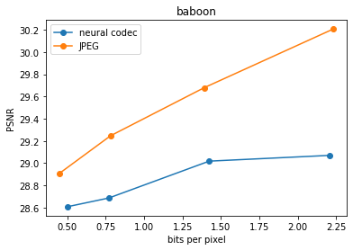
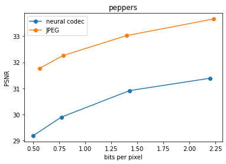

# neural image compression

Сжатие изображений с помощью нейросетей. На данный момент используются сверточные слои предобученного resnet-18 в качестве энкодера и их зеркальная версия в качествве декодера.

## Запуск

Чтобы воспользоваться реализованным кодеком, необходимо [скачать папку weights](https://cloud.mail.ru/public/pA8G/zuxUJJmfv) и поместить её в корень репозитория.

### Кодирование

Чтобы сжать изображение, хранящееся по пути path/to/raw/img.png выполните команду:
```
python encode.py -i path/to/raw/img.png
```

Обязательный параметр encode.py:
* ```--image_path```, ```-i``` - путь к картинке, котрую необходимо сжать

Опциональные параметры encode.py:
* ```-B``` - разрядность квантования. Чем выше, тем выше ожидаемое качество декодироиванного изображения, но выше и размер сжатого файла. После квантования вектор признаков имеет $2^B$ уровней. По умолчанию: ```6```
* ```--encode_output_path```, ```-o``` - путь, по которому будет сохранена сжатая картинка. По умолчанию: ```f"{img_path_no_ext}_B{B}.neural"```
* ```compressor_state_path```, ```-s``` - путь, по которому будет сохранено состояние алгоритма сжатия без потерь. По умолчанию: ```f"{img_path_no_ext}_B{B}_state.json"```
* ```--model_name```, ```-m``` - название нейронной сети для сжатия с потерями. Все модели перечислены в файле [trained_models.py](trained_models.py). По умолчанию: ```"default"```
* ```--looseless_compressor_name```, ```-l``` - название алгоритма сжатия без потерь. На данный момент поддерживанется только "huffman"

### Декодирование
Чтобы декодировать сжатое изображение ```path/to/compressed_img``` с разрядностью квантования ```b```, используя состояние алгоритма сжатия без потерь ```path/to/compressor_state``` выполните команду:
```
python decode.py -i path/to/compressed_img -B b -s path/to/compressor_state
```

Обязательные параметры encode.py:
* ```--compressed_img_path```, ```-i``` - путь к сжатой картинке, котрую необходимо декодировать

Опциональные параметры encode.py:
* ```compressor_state_path```, ```-s``` - путь, к состоянию алгоритма сжатия без потерь. По умолчанию f"{compressed_img_path_no_ext}_state.json"
* ```-B``` - разрядность квантования. Чем выше, тем выше ожидаемое качество декодироиванного изображения, но выше и размер сжатого файла. После квантования вектор признаков имеет $2^B$ уровней. По умолчанию: ```6```
* ```compressor_state_path```, ```-s``` - путь, по которому должно храниться состояние алгоритма сжатия без потерь. По умолчанию: ```f"{compressed_img_path_no_ext}_state.json"```
* ```--model_name```, ```-m``` - название нейронной сети для сжатия с потерями. Все модели перечислены в файле [trained_models.py](trained_models.py). По умолчанию: ```"default"```
* ```--looseless_compressor_name```, ```-l``` - название алгоритма сжатия без потерь. На данный момент поддерживанется только "huffman"
* ```--decode_output_path```, ```-o``` - путь до декодированного изображения. По усолчанию:  ```f"{compressed_img_path_no_ext}_decoder_output.bmp"```


<!-- Обучение производилось на подможестве классов датасета Imagenet (ссылка). Подможество классов перечислено в файле. -->

## Результаты





### Сравнение реализованного кодека при B = 6 с JPEG


### Сравнение реализованного кодека при B = 1 с JPEG


### Сравнение внешнего вида с оригиналом
B = 6:


B = 1:
